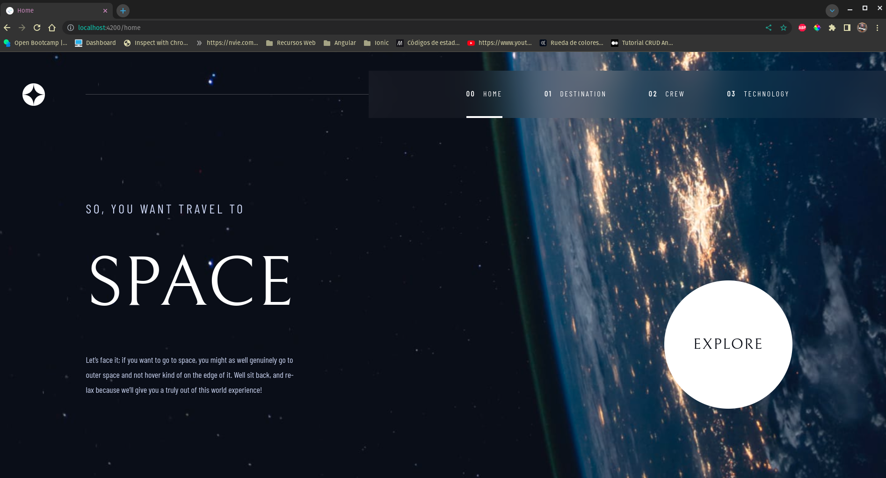
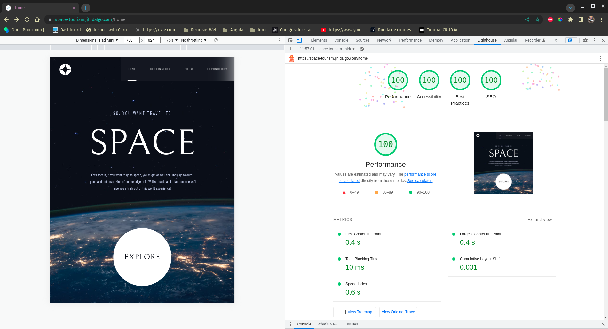

# 🚀 Frontend Mentor - Space tourism website solution
🇬🇧 English | 🇪🇸 [Español](./docs/LEEME.md)

This is a solution to the [Space tourism website challenge on Frontend Mentor](https://www.frontendmentor.io/challenges/space-tourism-multipage-website-gRWj1URZ3). Frontend Mentor challenges help you improve your coding skills by building realistic projects. 

## 📑 Table of contents

- [🚀 Frontend Mentor - Space tourism website solution](#-frontend-mentor---space-tourism-website-solution)
  - [📑 Table of contents](#-table-of-contents)
  - [👀 Overview](#-overview)
    - [The challenge](#the-challenge)
    - [Screenshots](#screenshots)
    - [Links](#links)
  - [🔨 Built with](#-built-with)
  - [⚙️ Prerequisites](#️-prerequisites)
  - [🛠️ Installation](#️-installation)
  - [👨‍💻 Autor](#-autor)

## 👀 Overview

### The challenge

Users should be able to:

- View the optimal layout for each of the website's pages depending on their device's screen size
- See hover states for all interactive elements on the page
- View each page and be able to toggle between the tabs to see new information

### Screenshots





### Links

- Solution URL: [GitHub](https://github.com/Juan-Jose-Hidalgo/Space-Tourism)
- Live Site URL: [space-tourism.jjhidalgo.com](https://space-tourism.jjhidalgo.com)

## 🔨 Built with

- Flexbox
- CSS Grid
- Mobile-first workflow
- [Angular](https://angular.io//)
- [Sass](https://sass-lang.com/) - For styles

## ⚙️ Prerequisites

- Node.js v18.13.0 or higher
- Angular CLI v15.1.1 or higher
- npm v9.3.0 or higher

The application's proper functionality is not ensured with outdated versions of Node.js, Angular CLI, or npm. Please ensure that you have the appropriate versions installed to guarantee smooth operation of the application.

## 🛠️ Installation

Steps to install and configure the application locally in a development environment

1. Clone this repository.
2. Run the ```command npm install``` to install project dependencies.
3. Run the command ```npm run start``` to start the development server.
4. Open your web browser and go to the URL http://localhost:4200 to see the application in action.

**Note**: To build the application for production deployment on a web server, you need to run the command ```ng build --configuration=production```. This will generate a folder called dist, which you should upload to your web server. Inside that folder, create a file called robots.txt and add the following line: ```User-agent: *```. With this, you have everything you need to upload your website to a server of your choice.


## 👨‍💻 Autor
- Website - [Juan Hidalgo](https://jjhidalgo.com)
- Frontend Mentor - [@Juan-Jose-Hidalgo](https://www.frontendmentor.io/profile/Juan-Jose-Hidalgo)
- GitHub - [Juan Hidalgo](https://github.com/Juan-Jose-Hidalgo)
- Linkedin - [Juan Hidalgo](https://www.linkedin.com/in/juan-jos%C3%A9-hidalgo-ya%C3%B1ez-854698b4/)
