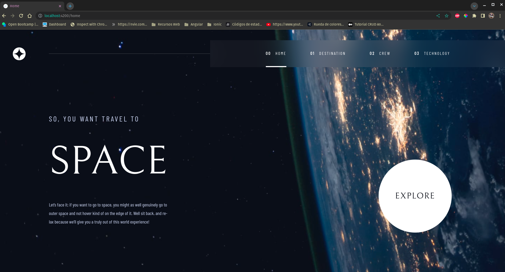
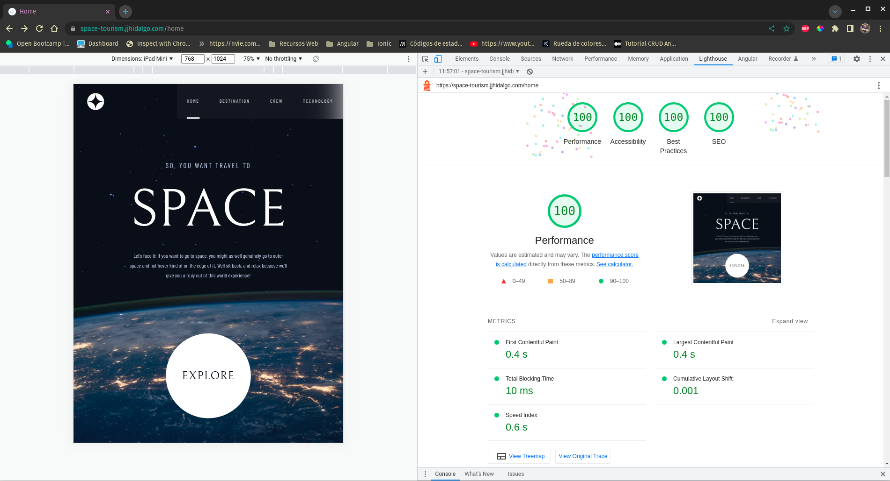

# 🚀 Frontend Mentor - Solución del sitio web Space-tourism
🇬🇧 [English](../README.md) | 🇪🇸 Español

Esta es una solución para el desafío de [página del desafío Space-tourism de Frontendmentor](https://www.frontendmentor.io/challenges/space-tourism-multipage-website-gRWj1URZ3). Los desafíos de Frontend Mentor te ayudan a mejorar tus habilidades de codificación construyendo proyectos realistas. 

## 📑 Tabla de contenidos

- [🚀 Frontend Mentor - Solución del sitio web Space-tourism](#-frontend-mentor---solución-del-sitio-web-space-tourism)
  - [📑 Tabla de contenidos](#-tabla-de-contenidos)
  - [👀 Visión general](#-visión-general)
    - [El desafío](#el-desafío)
    - [Capturas de pantalla](#capturas-de-pantalla)
    - [Enlaces](#enlaces)
  - [🔨 Construido con](#-construido-con)
  - [⚙️ Requisitos previos](#️-requisitos-previos)
  - [🛠️ Instalación](#️-instalación)
  - [👨‍💻 Autor](#-autor)

## 👀 Visión general

### El desafío

Los usuarios deben ser capaces de:

- Ver el diseño óptimo de cada una de las páginas del sitio web dependiendo del tamaño de pantalla de su dispositivo.
- Ver los estados de hover para todos los elementos interactivos de la página.
- Ver cada página y ser capaces de alternar entre las pestañas para ver nueva información.

### Capturas de pantalla





### Enlaces

- URL con la solución: [GitHub](https://github.com/Juan-Jose-Hidalgo/Space-Tourism)
- Sitio web en vivo: [space-tourism.jjhidalgo.com](https://space-tourism.jjhidalgo.com)

## 🔨 Construido con

- Flexbox
- CSS Grid
- Mobile-first workflow
- [Angular](https://angular.io//)
- [Sass](https://sass-lang.com/) - For styles

## ⚙️ Requisitos previos

- Node.js v18.13.0 o superior
- Angular CLI v15.1.1 o superior
- npm v9.3.0 o superior

No se asegura el funcionamiento adecuado de la aplicación con versiones anteriores de Node.js, Angular CLI o npm. Asegúrate de tener las versiones correctas instaladas para garantizar el correcto funcionamiento de la aplicación.

## 🛠️ Instalación

Pasos para instalar y configurar la aplicación localmente en un entorno de desarrollo.

1. Clonar este repositorio.
2. Ejecutar el comando ```npm install``` para instalar las dependencias del proyecto.
3. Ejecutar el comando ```npm run start``` para iniciar el servidor de desarrollo.
4. Abrir el navegador y acceder a la URL http://localhost:4200 para ver la aplicación en funcionamiento.

**Nota:** Para hacer el build de producción de la aplicación para su posterior subida a un servidor web, deberás ejecutar el comando ```ng build --configuration=production```. Esto generará una carpeta llamada dist que es la que deberás subir a tu servidor web. Dentro de dicha carpeta, crea un archivo llamado **robots.txt** y añade la siguiente línea ```User-agent: *```. Con esto ya tienes todo lo necesario para subir tu sitio web a un servidor de tu elección.

## 👨‍💻 Autor
- Website - [Juan Hidalgo](https://jjhidalgo.com)
- Frontend Mentor - [@Juan-Jose-Hidalgo](https://www.frontendmentor.io/profile/Juan-Jose-Hidalgo)
- GitHub - [Juan Hidalgo](https://github.com/Juan-Jose-Hidalgo)
- Linkedin - [Juan Hidalgo](https://www.linkedin.com/in/juan-jos%C3%A9-hidalgo-ya%C3%B1ez-854698b4/)
